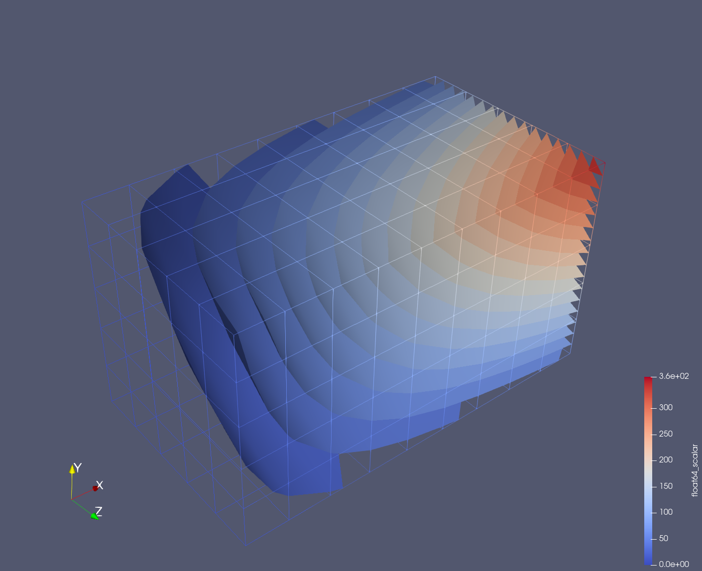
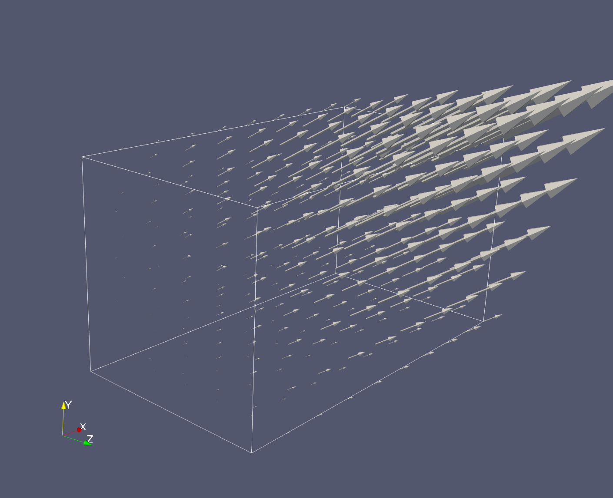
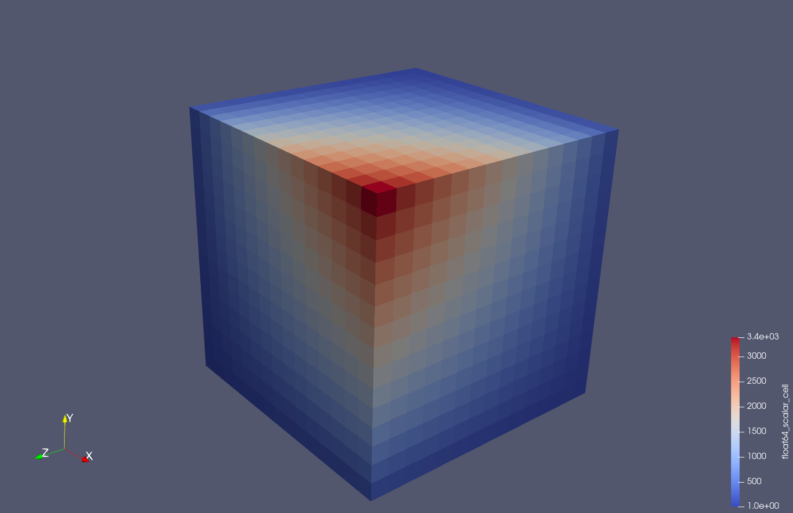
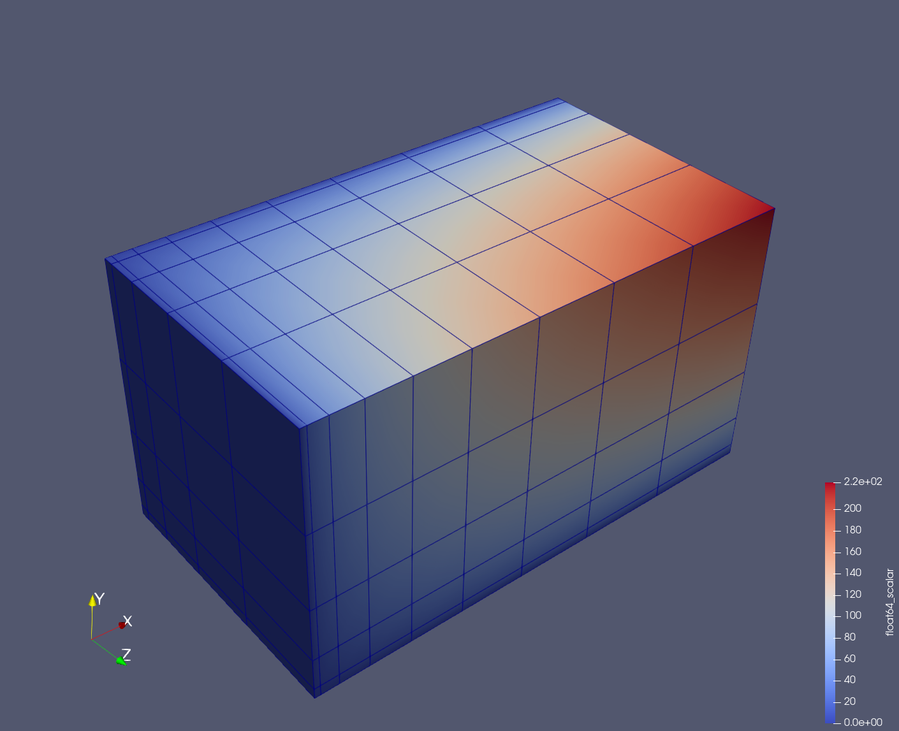

# Examples of VTKFortran

FortranでVTKファイルフォーマットを扱うAPIを提供する[VTKFortran](https://github.com/szaghi/VTKFortran)の使用例．

## 要求ソフトウェア
- fpm
- VTKFortran
    - PENF
    - FACE
    - BeFoR64
    - FoXy
    - StringiFor
- Fortranコンパイラ
    - gfortran
    - Intel oneAPI

## fpm対応
VTKFortranのオリジナル版は，fpmによるビルドに対応していない．そのため，リポジトリをforkし，fpmに対応した[ブランチ](https://github.com/degawa/VTKFortran/tree/vtkfortran-fpm)を作成した．
依存ライブラリも同様にforkし，fpmに対応した．

## ビルドおよび実行
ビルドおよび実行には[fpm](https://github.com/fortran-lang/fpm)を用いる．

### gfortranによるビルド

```console
fpm build --flag "-D_R16P"
```
を実行してビルドする．ビルドにはコンパイラに渡すオプション`--flag "-D_R16P"`が必要である．VTKFortran自身はこのオプションを必要としないが，依存するライブラリがこのオプションを必要とする．

ビルドが成功した後，次のコマンドによってプログラムを実行する．
```console
fpm run --flag "-D_R16P"
```

### Intel Fortranによるビルド
先述のコンパイルオプションに加えて，コンパイラを選択するオプションが必要である．Linux版のifortでは，コンパイラオプションを示す記号`/`を`-`に変更する．

```console
fpm build --compiler ifort --flag "/fpp /D_R16P"
```

```console
fpm run --compiler ifort --flag "/fpp /D_R16P"
```

## VTKFortranの使用例
RectilinearGrid Grid上の値を出力するモジュールとStructured Grid上の値を出力するモジュールを作成し，その中にモジュールサブルーチンとして使用例を実装した．

1. ex_vtkfortran_vtr
2. ex_vtkfortran_vts

### ex_vtkfortran_vtr
- ノードに定義されたスカラ値の出力
- ノードに定義されたベクトル値の出力
- セルに定義されたスカラ値の出力

### ex_vtkfortran_vts
- ノードに定義されたスカラ値の出力

## サブルーチン一覧
### ex_vtkfortran_vtrモジュール
#### `write_scalar_node_vtr()`
RectilinearGrid Grid上のノードに定義されたスカラ値を出力する例．

x∈[1, 10], y∈[1, 6], z∈[1, 6]の領域を，それぞれ10, 6, 6点で等間隔に離散化する．格子点上（ノード）で定義されるスカラ値v=xyzを3次元配列に計算して出力する．

下記のようなXML形式のvtrファイルを出力する．

```XML
<?xml version="1.0"?>
<VTKFile type="RectilinearGrid" version="1.0" byte_order="LittleEndian">
  <RectilinearGrid WholeExtent="+1 +10 +1 +6 +1 +6">
    <Piece Extent="+1 +10 +1 +6 +1 +6">
      <Coordinates>
        <DataArray type="Float64" NumberOfComponents="1" Name="X" format="appended" offset="0"/>
        <DataArray type="Float64" NumberOfComponents="1" Name="Y" format="appended" offset="84"/>
        <DataArray type="Float64" NumberOfComponents="1" Name="Z" format="appended" offset="136"/>
      </Coordinates>
      <PointData>
        <DataArray type="Float64" NumberOfComponents="1" Name="float64_scalar" format="appended" offset="188"/>
      </PointData>
    </Piece>
  </RectilinearGrid>
  <AppendedData encoding="raw">
raw data...
  </AppendedData>
</VTKFile>
```



#### `write_vector_node_vtr()`
RectilinearGrid Grid上のノードに定義されたベクトル値を出力する例．

x∈[1, 10], y∈[1, 6], z∈[1, 6]の領域を，それぞれ10, 6, 6点で等間隔に離散化する．格子点上（ノード）で定義されるベクトル値u=0.5x, v=y, w=1.5zを個別の3次元配列に計算して出力する．

下記のようなXML形式のvtrファイルを出力する．

```XML
<?xml version="1.0"?>
<?xml version="1.0"?>
<VTKFile type="RectilinearGrid" version="1.0" byte_order="LittleEndian">
  <RectilinearGrid WholeExtent="+1 +10 +1 +6 +1 +6">
    <Piece Extent="+1 +10 +1 +6 +1 +6">
      <Coordinates>
        <DataArray type="Float64" NumberOfComponents="1" Name="X" format="appended" offset="0"/>
        <DataArray type="Float64" NumberOfComponents="1" Name="Y" format="appended" offset="84"/>
        <DataArray type="Float64" NumberOfComponents="1" Name="Z" format="appended" offset="136"/>
      </Coordinates>
      <PointData>
        <DataArray type="Float64" NumberOfComponents="3" Name="float64_vector" format="appended" offset="188"/>
      </PointData>
    </Piece>
  </RectilinearGrid>
  <AppendedData encoding="raw">
raw data...
  </AppendedData>
</VTKFile>
```



#### `write_scalar_cell_vtr()`
RectilinearGrid Grid上のセルに定義されたスカラ値を出力する例．

x∈[1, 16], y∈[1, 16], z∈[1, 16]の領域を，それぞれ16, 16, 16点で等間隔に離散化する．セル（セル中心？）で定義されるスカラ値vxyzを個別の1次元配列に計算して出力する．

下記のようなXML形式のvtrファイルを出力する．

```XML
<?xml version="1.0"?>
<VTKFile type="RectilinearGrid" version="1.0" byte_order="LittleEndian">
  <RectilinearGrid WholeExtent="+1 +16 +1 +16 +1 +16">
    <Piece Extent="+1 +16 +1 +16 +1 +16">
      <Coordinates>
        <DataArray type="Float64" NumberOfComponents="1" Name="X" format="appended" offset="0"/>
        <DataArray type="Float64" NumberOfComponents="1" Name="Y" format="appended" offset="132"/>
        <DataArray type="Float64" NumberOfComponents="1" Name="Z" format="appended" offset="264"/>
      </Coordinates>
      <CellData>
        <DataArray type="Float64" NumberOfComponents="1" Name="float64_scalar_cell" format="appended" offset="396"/>
      </CellData>
    </Piece>
  </RectilinearGrid>
  <AppendedData encoding="raw">
raw data...
  </AppendedData>
</VTKFile>
```



### ex_vtkfortran_vtsモジュール
#### `write_scalar_node_vts()`
Structured Grid上のノードに定義されたスカラ値を出力する例．

x∈[0, 9], y∈[0, 5], z∈[0, 5]の領域を，それぞれ10, 6, 6点で離散化する．点の間隔が不等間隔になるように，X = x_max*(x/x_max)^2, Y = y_max*(y/y_max)^2, Z = z_max*(z/z_max)^2と計算している．格子点上（ノード）で定義されるスカラ値v=xyz（XYZではない）を3次元配列に計算して出力する．

下記のようなXML形式のvtsファイルを出力する．

```XML
<?xml version="1.0"?>
<VTKFile type="StructuredGrid" version="1.0" byte_order="LittleEndian">
  <StructuredGrid WholeExtent="+0 +9 +0 +5 +0 +5">
    <Piece Extent="+0 +9 +0 +5 +0 +5">
      <Points>
        <DataArray type="Float64" NumberOfComponents="3" Name="Points" format="appended" offset="0"/>
      </Points>
      <PointData>
        <DataArray type="Float64" NumberOfComponents="1" Name="float64_scalar" format="appended" offset="8644"/>
      </PointData>
    </Piece>
  </StructuredGrid>
  <AppendedData encoding="raw">
raw data...
  </AppendedData>
</VTKFile>
```


